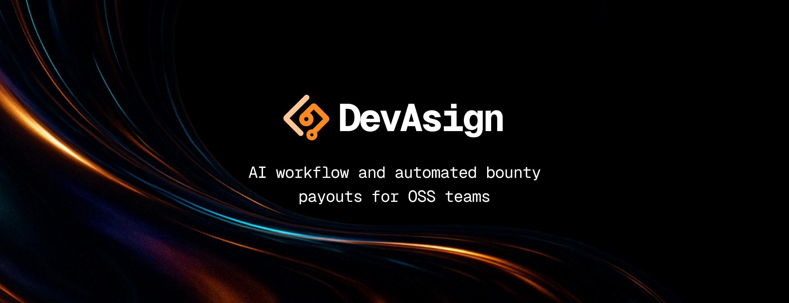

# We’re building the operating system for open-source collaboration.

---

## 🚀 Our Solution

- **🧠 Automated PR Merges**  
  AI-powered validation and merging of GitHub pull requests—no manual gatekeeping.

- **💬 Context-Aware Threads**  
  Every issue, comment, and update is tied to its task context—no more hopping between tools.

- **💰 Smart Contract Payments**  
  Instant, on-chain payments in stablecoins upon merge via Soroban smart contracts.

- **🔐 Secure Onboarding**  
  Wallet creation, KYC, and payout flow handled upfront for trust and compliance.

---

## 🌐 Quick Links

- 🔗 Website: [www.devasign.com](https://www.devasign.com)  
- 📖 Docs: _Coming Soon_  
- 💬 Email: [bethel@devasign.com](mailto:bethel@devasign.com)  
- 💻 GitHub Org: [github.com/devasignhq](https://github.com/devasignhq)

---

## 📈 Roadmap

| Quarter     | Milestone                                  |
|-------------|---------------------------------------------|
| **Q3 2025** | Proof-of-Concept launch                     |
| **Q4 2025** | MVP rollout with GitHub + payment modules   |
| **2026**    | Community expansion & governance features   |

---

Powered by Stellar • Backed by Stellar Development Community
