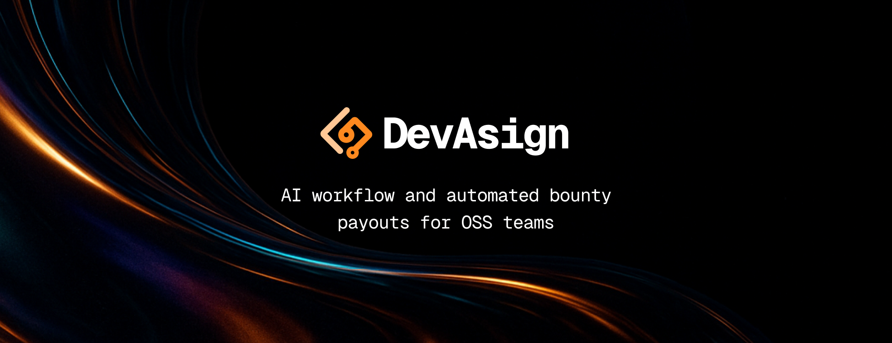

## Enabling OSS teams move faster with: 

- **Code Review:** Run test, replicate bugs, check if code is out of issue scope, etc.

- **Intelligent Feedback:** Analyse PR and send actionable feedback to contributors via DM when PRs can't be merged.

- **Automatic Bounty Payments:** Instant, on-chain bounty payments in stablecoins upon PR merge via Soroban smart contracts.

- **Secure Onboarding:** Wallet creation, KYC, and payout flow handled upfront for trust and compliance.

## Quick Links

- 🔗 Website: [www.devasign.com](https://www.devasign.com)  
- 💬 Email: [developer@devasign.com](mailto:developer@devasign.com)  
- 💻 GitHub Org: [github.com/devasignhq](https://github.com/devasignhq)

## Roadmap

| Quarter     | Milestone                                  |
|-------------|---------------------------------------------|
| **Q3 2025** | Proof-of-Concept launch                     |
| **Q4 2025** | MVP rollout with GitHub + bounty payment modules   |
| **2026**    | Community expansion & governance features   |
